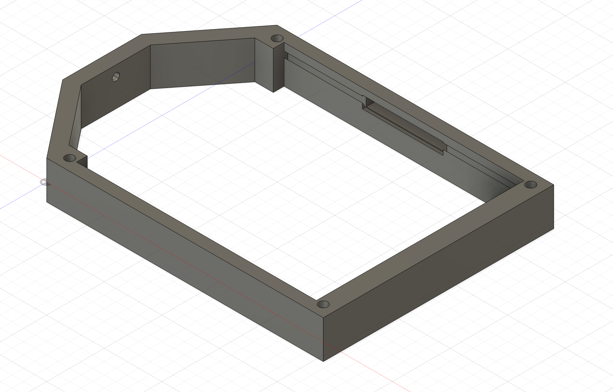
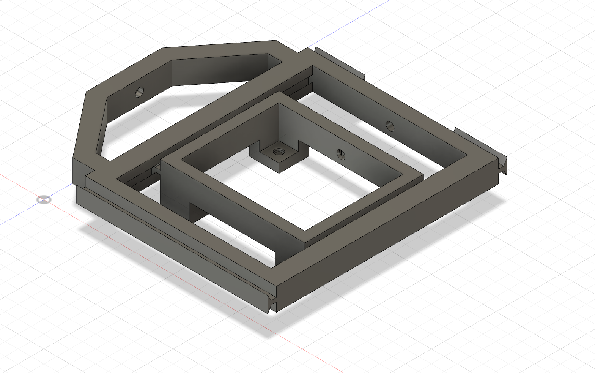
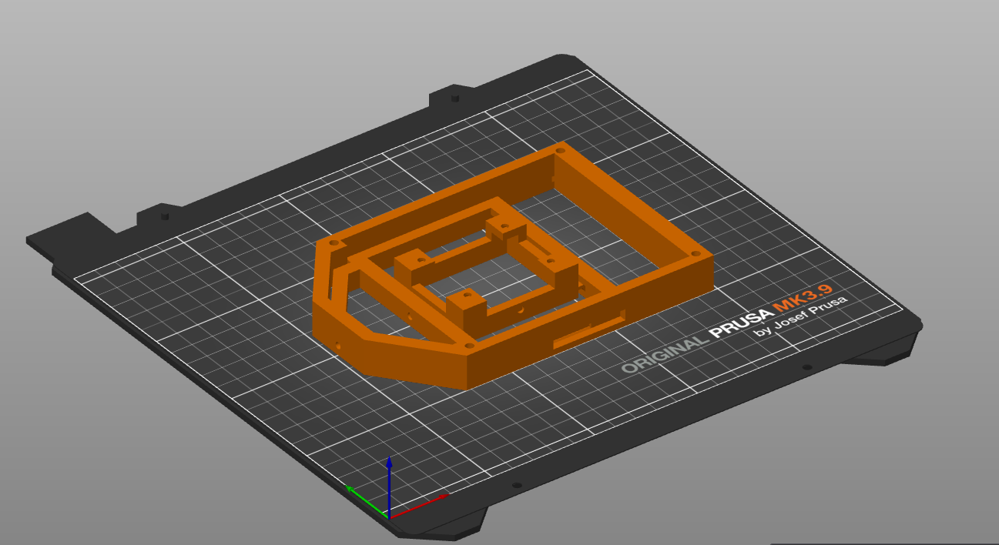
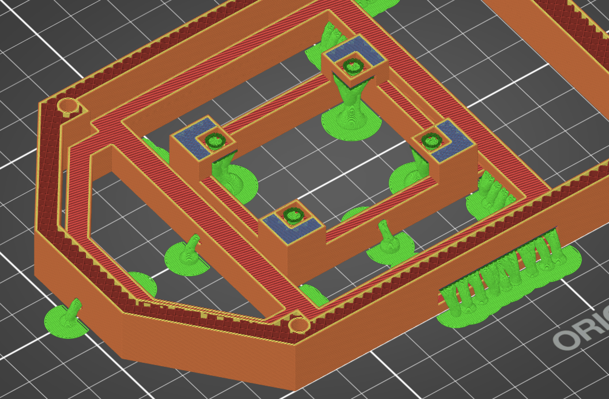
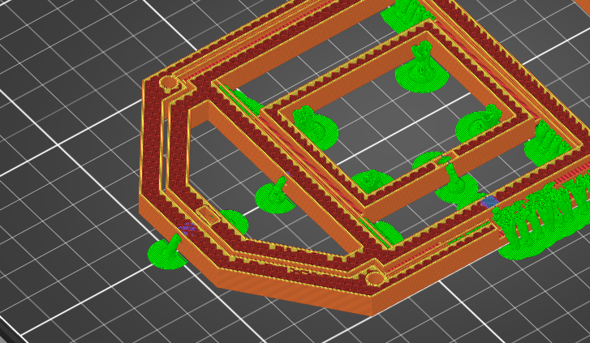
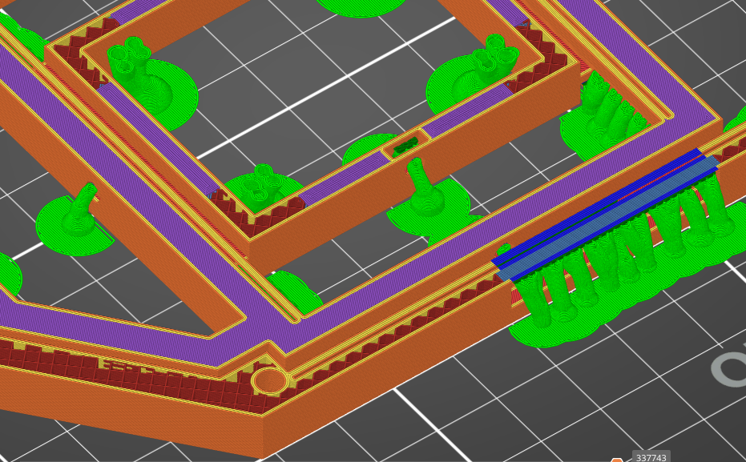
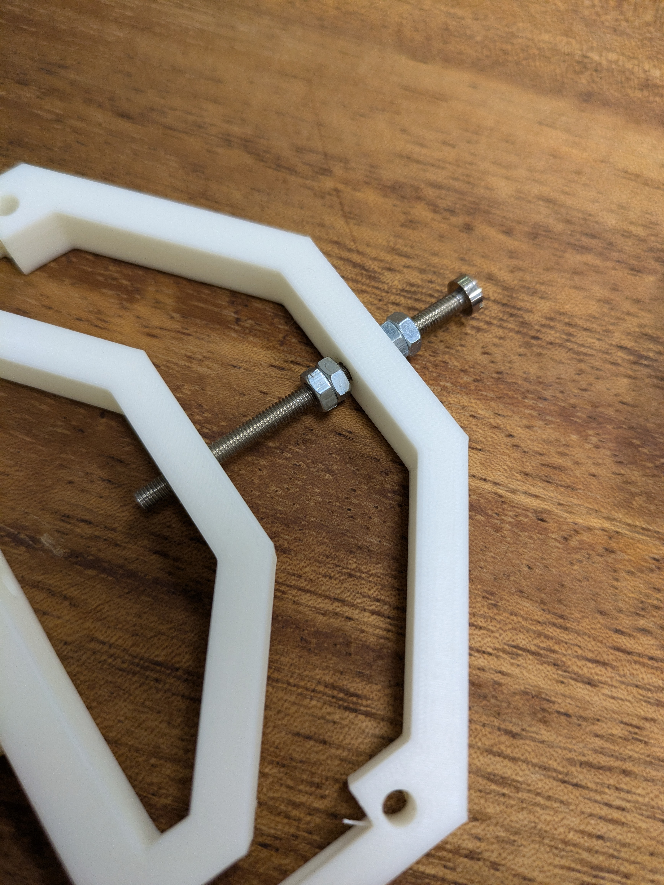
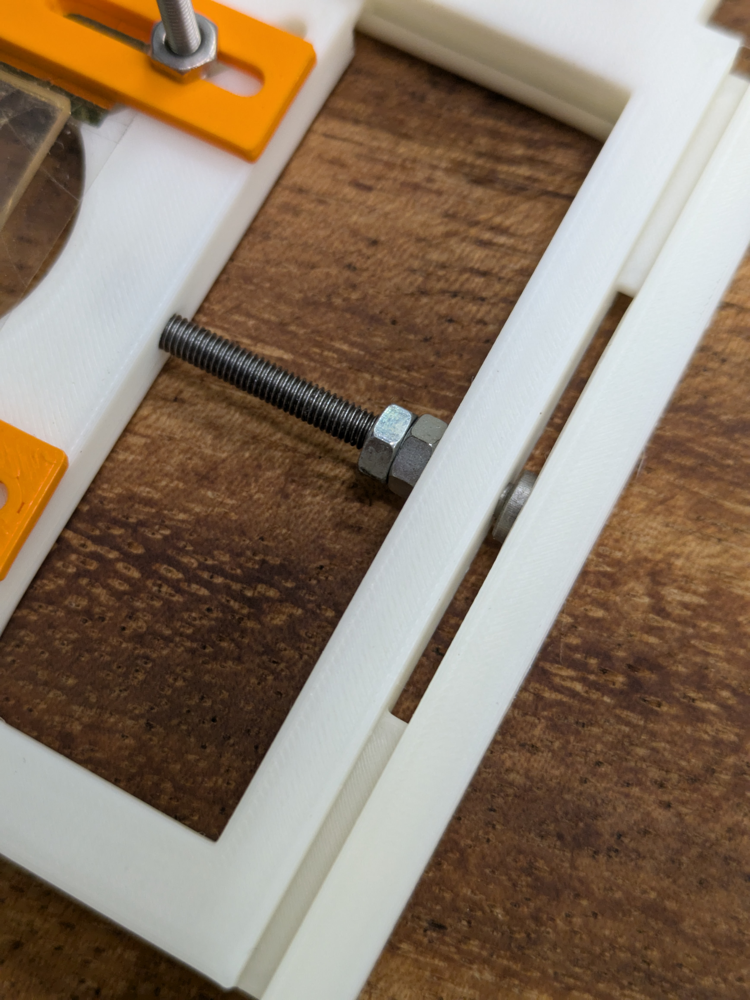
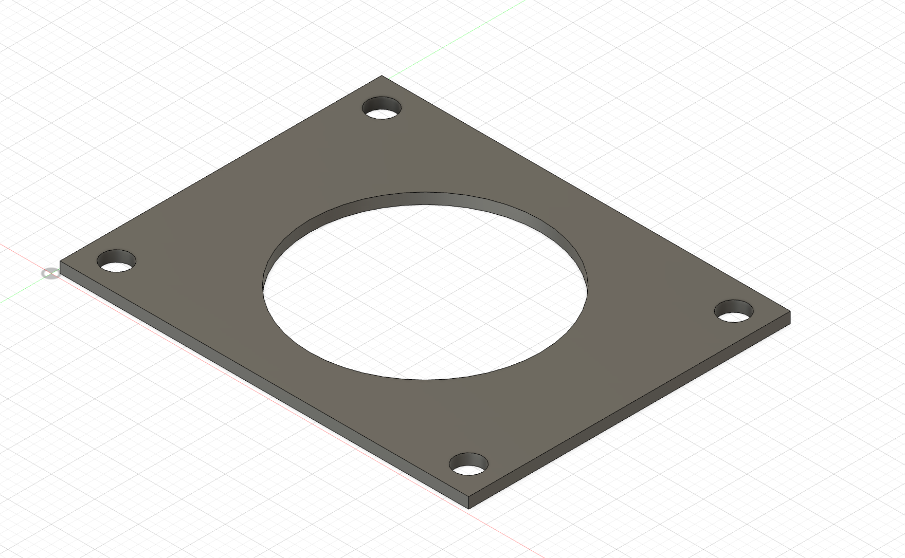
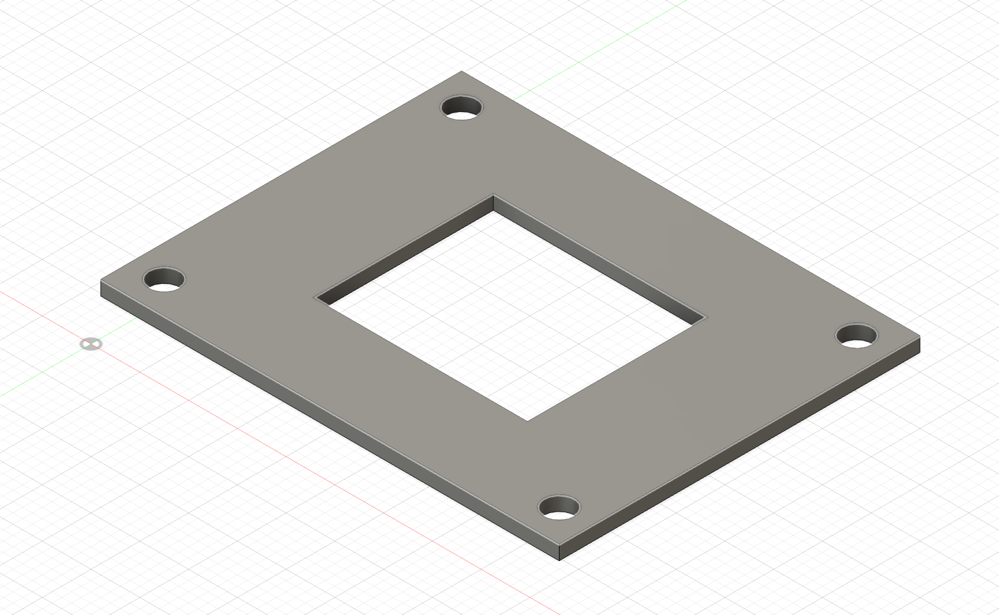

# Introduction 

The Flamingo microscope requires a laser to be shined to the sample at a
reflection angle from the side of the camera. For this to be possible in
a compact and easy to set-up build, one must a sample holder with a
hollow center, so that images of the sample can be taken. At the same
time, in order to be able to see different parts of the sample
accurately, one needs a sample holder that moves in the x and y
directions with a central hole. Since we could not find any such sample
holders of appropriate size and cost, we decided to design one
ourselves.

The current design of the 2D Sample Holder was designed with ease of
manifacturing in mind, and is easily modifiable to fit the desired
specifications for other microscopes thanks to its parametric design in
Fusion 360. The 2D-moving stage has been designed to give approximately
30 mm of travel in both the x and y directions. This allows the user to
fully explore each sample.

# Sample Holder Design

The 2D stage consists of three components printed in place with the use
of a 3D printer. The outer component, shown on the left in figure 1, has inserts
along its vertical axis that the inner component (figure 1, right) slots in
with its rails. A square nut is inserted during the 3D print inside the
center horse-shoe bend in the inner component. Then the inner component
can be moved along the vertical axis by placing an M3 bolt through the
hole in the outer component followed by two nuts locked against each
other so that as the bolt spins in place it moves the inner stage.
Similarly, the inner stage has rails in the horizontal orientation and a
square nut dropped in its left side. This allows us to move the inner
component horizontally in the same way. In addition, it is possible to
see a window in the side of the outer component, which has been
carefully designed to allow access to the bolt responsible for the inner
stage's horizontal movement through the stage's entire vertical range of
motion. The center of the sample holder is hollow with four square
protrusions where M3 square nuts should be inserted. This allows the
user to screw in plaques that will hold the sample in place.

It is easy to notice that the outer walls of the sample holder are
taller than its inner island. That is the case to ensure that the laser
going through the microscope's Olympus stage does not interfere with the
stage.

  
  
  <figcaption>Figure 1: Outer Wall (left) and Inner Island (right) components of sample holder<figcaption>

# Print Settings

We suggest printing the stage in tough PLA as it allows for a cleaner
print of the rails, which are printed in place, hence allowing the stage
to have minimal z-fluctuations as the sample is moved. The increased
z-stability allows the microscope to remain focused as the sample is
moved, which enables the user to more easily explore the sample. It is
also advisable to print the design with a 2-layer raft beneath the
sample holder, with the top of the sample holder facing the print plate
as shown in figure 2.

  
    <figcaption>Figure 2: Inner Island Sample Holder</figcaption>

We suggest printing the stage using a 0.25mm nozzle heated at 205
degrees Celsius, enabling organic supports exclusively (meaning supports
that start from the print plate and arch into parts of the design to be
supported). This will prevent supports from being printed inside the
sample holder's rails system, which would make their removal complicated
and scarring of the rail system likely. This would cause increased
friction in the rail system and increase the likelihood of the system
jamming during use. In addition, the 3D printer will likely want to
support the four square protrusions in the stage's inner island, as
shown in figure 4. It is necessary to block the printer from building
supports inside these square protrusions so that the four square M3 nuts
can be placed inside them. 

  
    <figcaption>Figure 3: Blocked Supports in square protrusions</figcaption>

Lastly, since the stage is supposed to have six square nuts; five in the
inner stage and one in the center of the horse-shoe bend in the inner
rim of the stage as shown in figure 4, the user should pause the print
at the layer right before the nut-holes are covered by the 3D printer
and place the nuts in the print. Four of the M3 nuts should be placed in
the squares protruding in the inner perimeter of the sample holder,
these will allow the user to secure

Notice that the hole in the inner part of the stage is lower than the
one in the horseshoe bend, hence two pauses will be necessary.

    <figure style="text-align: center;">
        
        <figcaption>Figure 4: Pause layer for front nut, 
    </figure>
    <figure style="text-align: center;">
        
        <figcaption>Figure 5: Pause layer for side nut <figcaption>
    </figure>

# Assembling the Sample Holder

Once the sample holder is done printing, the x-y moving sample holder is
almost ready. To complete it, you will need: one M3 bolt
36mm long, one M3 bolt 42mm long.

Place the longer M3 bolt in the outermost front hole of the stage (on
the horseshoe bend) and thread the two nuts on it. If you have an M3
bolt longer than 42mm, you should thread two nuts on the bolt before
inserting it in the outermost hole and then tighten them to each other
using pliers to ensure that the length by which the M3 bolt is
protruding in the stage is 30mm. Then you need to lock the two nuts
inside the first hole of the stage against each other as close to the
outermost hole in the stage as possible but not so close that the bolt
has difficulty spinning. You should repeat the same procedue for the
shorter bolt in the side of the stage. The assembled bolts are shown in
figures 6 and 7.

    <figure style="text-align: center;">
        
        <figcaption>Figure 6: Pause layer for front nut, 
    </figure>
    <figure style="text-align: center;">
        
        <figcaption>Figure 7: Pause layer for side nut <figcaption>
    </figure>

Lastly, we need to discuss the method to install the plaques securing the sample to the
sample holder.

# Sample Securing Plaques

In order to lock the sample to the sample holder, we have designed two plaques. A bottom plaque that the sample will rest on and a top placque that will secure the sample in place. The file 'plaques.f3d' contains both plaques. In this case, we are using the fact that our sample has a raised center part where the sample sits to leave a snug opening in the top placque which will help us center the sample easily. The plaques.f3d file is parametrized so that the upper plaque can be changed easily, which allows users to use any other sample as long as it fits in the sample holder. The upper and lower plaues are shown in Figures 8 and 9.

    <figure style="text-align: center;">
        
        <figcaption>Figure 8: Lower plaque <figcaption>
    </figure>
    <figure style="text-align: center;">
        
        <figcaption>Figure 9: Upper Plaque <figcaption>
    </figure>

The plaques should be printed with a 15% infill and any PLA will do just fine. 

# Possible Improvements and Modifications

The 2D sample stage is designed using a parametric design with a well-defined history in AutoDesk. This will allow users to make modifications to its size, proportions, and details without major difficulties. In the future, there is scope to re-design the plauqes to accept add-ons. For instance, it would be easy to design supports for potential inducing rods to study electrophoresis on samples by modifying the top plaque slightly. In addition, it would be possible to design a upper "cap" for the sample holder so that no background light enters the microscope's objective during measurments. This could again be easily done by building onto the current design of the 2D stage. 
