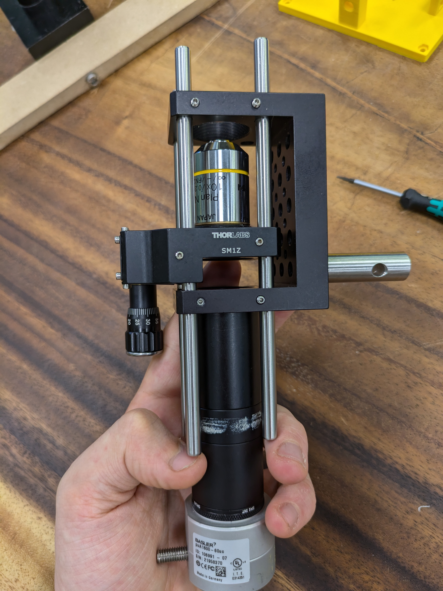
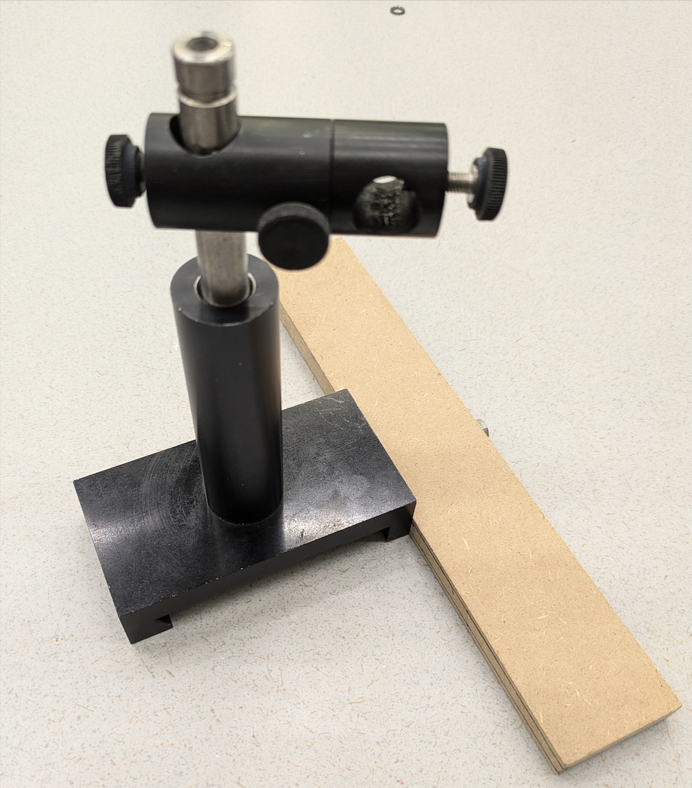
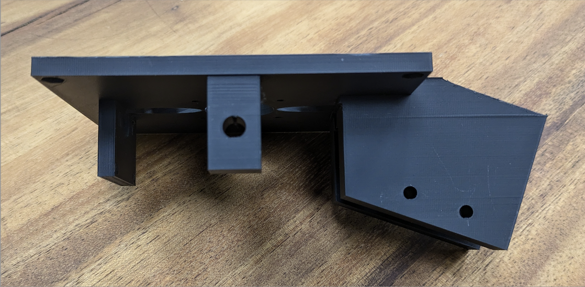
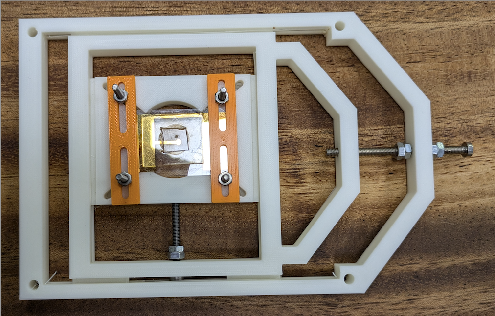
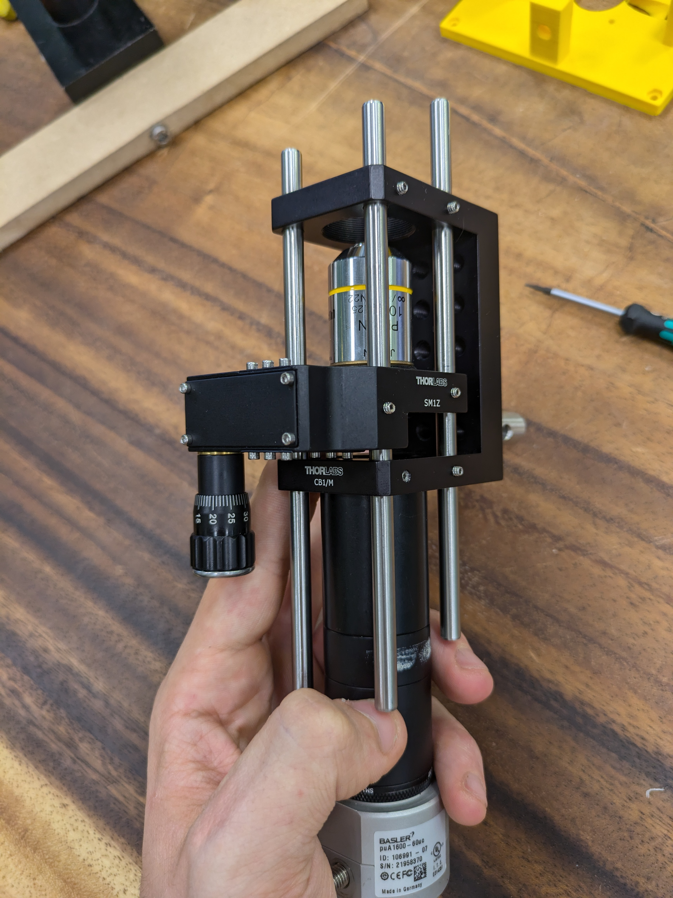
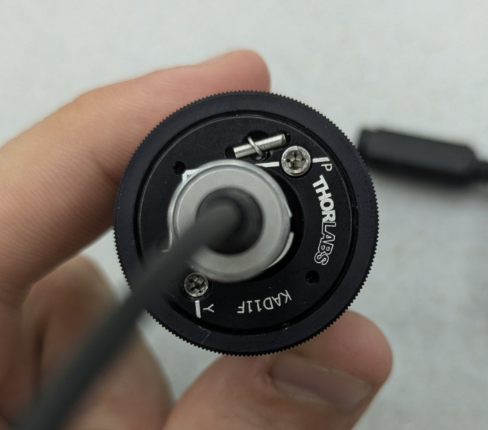

# Introduction

<figure style="float: right; margin-left: 15px; width: 30%;">
  
  <figcaption style="text-align: center;">Figure 1: Complete Microscope Set-up</figcaption>
</figure>

The microscope is comprised of 4 main parts:

1.  A stabilising base

2.  The microscope body, including camera and a magnifying lens

3.  The microscope Olympus stage

4.  The sample holder

The complete set-up is pictured in figure 1  and each main item of the set-up is pictured in figures 2-5. The current stabilising base is a practical, yet overly simplistic, work-around, given that the microscope's base will be secured to a metal bar in the lab. However, a similar work-around could be useful for other interested users with limited budget/space. 

<!DOCTYPE html>
<html lang="en">
<head>
    <meta charset="UTF-8">
    <meta name="viewport" content="width=device-width, initial-scale=1.0">
    
</head>
<body>
    

        <figure class="grid-item">
            
            <figcaption>Microscope Main Body</figcaption>
        </figure>
        <figure class="grid-item">
            
            <figcaption>Microscope Stabilising Base</figcaption>
        </figure>
        <figure class="grid-item">
            
            <figcaption>Olympus Stage</figcaption>
        </figure>
        <figure class="grid-item">
            
            <figcaption>Sample Holder</figcaption>
        </figure>
    

</body>
</html>

# Building Instructions

To build the microscope, it is wise to build main-component by main
component and then assemble everything together. In what follows,
instructions to build each of the miscroscope's main compomenents and
then combine them are laid out.

## Assembling Microscope Body

The parts making up the main body of the microscope are:

1.  ThorLabs SM1Z - Z-Axis Translation Mount, shown in Figure

2.  ThorLabs CB1/M Cage System, shown in Figure

3.  ThorLabs SM1A9 camera adapter

4.  ThorLabs Lens Tubes compatible with 30mm cage system, total length
    78mm

5.  3x ThorLabs ER6 Cage Assembly Rods

6.  9x 4-40 Threaded Bolts 1.3m HEX head [^1]

7.  Olympus PLN 10X Objective

8.  Basler puA1600-60uc Camera

9.  ThorLabs KAD11F Green Laser

To build the main body of the micrscope, attach the camera to the SM19 camera adapter and then screw the lens tubes to the adapter. Then, the end of the last lens tube should be screwed onto the CB1/M cage, as shown in figure 6.

Now, with the side wall of the CB1/M cage facing as in figure 6, thread six 4-40 bolts, four on the corners of the cage closer to the camera in figure 6 and two on the right corner further from the camera as shown in figure 7.

    <figure style="text-align: center;">
        
        <figcaption>Figure 6: Main Body Skeleton <figcaption>
    </figure>
    <figure style="text-align: center;">
        
        <figcaption>Figure 7: 4-40 Bolts Placement- <figcaption>
    </figure>

Insert the three cage assembly rods in the holes on the top of the cage system where the bolts were inserted as shown in figure 7, making sure to unscrew the bolts if the rods are having difficulty sliding in. Once the rods are through the top holes of the cage system, secure the Olympus PLN 10x Objective to the SM1Z translation mount; insert the translation mount inside the cage system with the Z-axis adjustment knob nearest to the side of the cage system with the single rod; and let the rods pass through the slots in the translation mount and the bottom slots of the cage system, as shown in figure 7.

## Assembling Olympus Stage 

The instructions to 3D print the Olympus Stage are found in the Olympus Stage folder. Once the Olympus Stage is printed and the supports are removed, it will be secured to the main body of the microscope by threading three 4-40 bolts into the eyelets on the bottom of the stage and then threading the cage assembly rods onto these bolts. In addition, double-sided strong tape can be used to fully secure the Olympus stage if vibrations are observed during the microscope's functioning.

It is important to thread the 4-40 bolts in the right places, and doing so is complicated by the fact that the Olympus stage's eyelets are not threaded, which means that the bolts need to first be threaded into the stage before threading the rods onto them. To pick the right placement on the stage for the bolts, thread them into the slots underneath the stage corresponding to the rods in the cage system being careful that the stage be oriented such that the rectangle protruding from the bottom of the stage is next to the wall of the ThorLabs cage system, see figure 8 for the Olympus stage threaded onto the main body of the microscope.

    <figure style="text-align: center;">
        
        <figcaption>Figure 8: Main Body with Olympus Stage <figcaption>
    </figure>

To thread the cage assembly rods onto the 4-40 bolts, make sure that all the rods spin freely and then thread them onto the bolts in the stage. Since the magnifying lens will be moving freely too, be careful to keep it raised in place if you put the main body of the microscope upside down to more easily thread the cage assembly rods onto the bolts.

    <figure style="text-align: center;">
        
        <figcaption>Figure 9: Placement for m3 bolts securing laser to stage <figcaption>
    </figure>
    <figure style="float: right; margin-left: 15px; width: 100%;">
        
        <figcaption style="text-align: center;">Figure 10: Laser Adjustment Bolts</figcaption>
    </figure>

Lastly, place the ThorLab KADF11 laser inside the laser holder and tighten the laser holding sleeve onto the laser by passing two M3 bolts through the side holes of the laser holder and tightening a nut to each bolt, as shown in figure 9. Be careful to point the laser close to the center of the stage opening as you tighten the laser holder, more precise adjustments can later be realised by turning the adjustment bolts built into the laser, shown in figure 10.

## Mounting the Base and Sample Holder

It is now a great time to mount the cage system on the base as shown in figure 11.

FIG11: Forgot to take picture, to be added 

    <figure style="text-align: center;">
        
        <figcaption>Figure 11: Main Body connected to Stand <figcaption>
    </figure>

Lastly, insert four M3 bolts through the eyelets in the corners of the sample holder and then place some nuts under the Olympus Stage and thread the bolts through them. Once these nuts are tightened, the microscope is complete. It is now possible to turn the laser on and connect the Basler camera to a computer using the USB cable provided with it. For more detail on how to operate Basler cameras and their SDK visit https://www.baslerweb.com/en/; see image 12 for the full set-up in operation. For more detail on how to assemble and build the microscope stage see the folder 2D Sample Holder Building Instructions. 

The set-up can be operated wusing python and the Elchemi package, which can be found in the Software folder of this project. The version of ELchemi deployed in this project has some important differences to the main branch of Elchemi, please deploy the version found under the Software directory in this project for best results with the current set-up.

